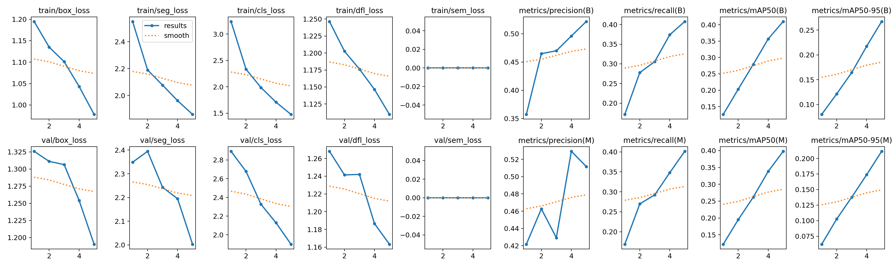
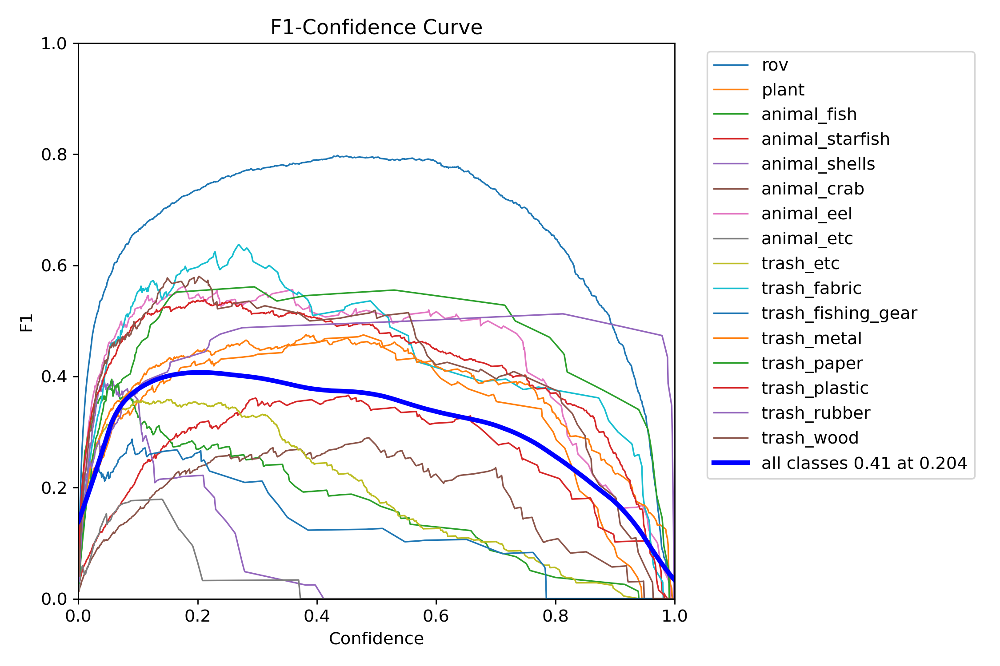
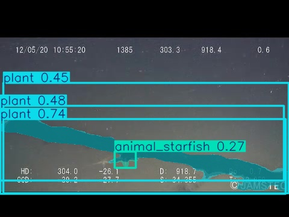
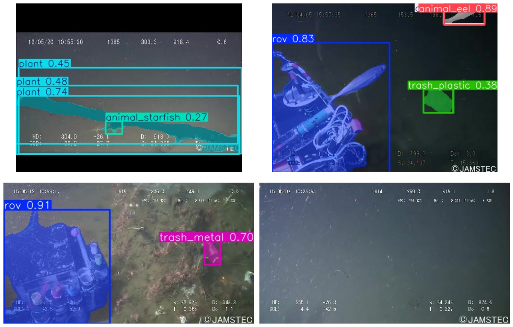
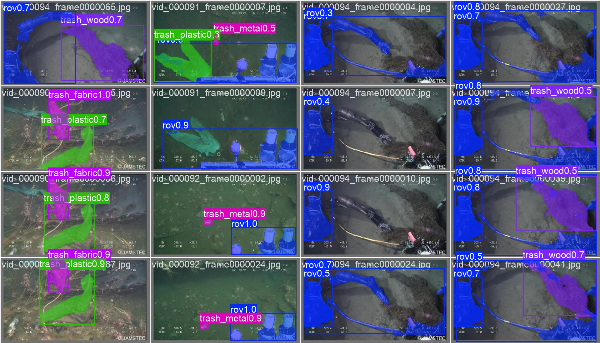
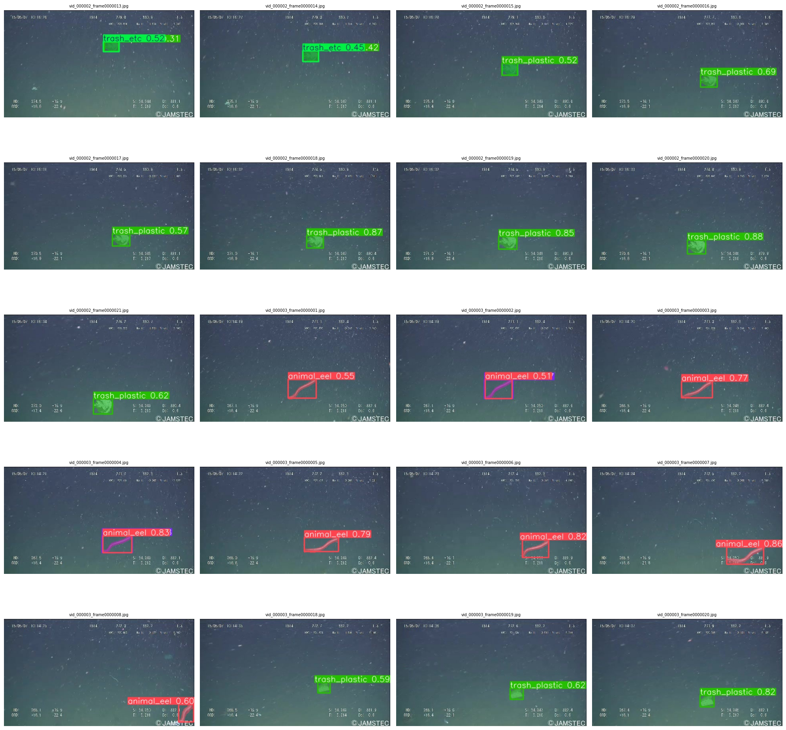

<div align="center">

# ♻️ Plastic Waste Detection via Spectral Signature Analysis

### Deep Learning-Based Marine Plastic Waste Detection and Segmentation


</div>

---

<div align="center">
  
## 🚀 Quick Facts

| Feature | Value |
|---------|-------|
| Model | YOLOv8 Instance Segmentation |
| Framework | Ultralytics + PyTorch |
| Language | Python |
| Environment | Google Colab |
| Task | Marine Plastic Waste Detection |
| Output | Pixel-level Segmentation |

</div>

---

# 📂 Repository Structure

```text
Plastic-Waste-Detection/
│
├── Plastic_Waste_Detection.ipynb      # Complete training & inference notebook
├── README.md
├── requirements.txt
├── LICENSE
│
├── screenshots/
│   ├── training_metrics.png
│   ├── f1_confidence_curve.png
│   ├── single_prediction.jpg
│   ├── prediction_gallery.png
│   ├── inference_examples.jpg
│   └── large_scale_predictions.png
│
├── weights/
│   └── best.pt
│
└── assets/
```

---

# 🏗 Project Workflow

```text
             Underwater Dataset
                     │
                     ▼
          Data Preprocessing
                     │
                     ▼
      YOLOv8 Segmentation Training
                     │
                     ▼
          Model Optimization
                     │
                     ▼
           Model Evaluation
                     │
                     ▼
          Image Segmentation
                     │
                     ▼
      Plastic Waste Detection
```

---

# ✨ Key Highlights

- ♻️ Automated Plastic Waste Detection
- 🧠 YOLOv8 Instance Segmentation
- 🎯 Pixel-Level Object Segmentation
- 🌊 Marine Waste Monitoring
- 📊 Model Performance Evaluation
- 📈 Precision, Recall & F1 Metrics
- 🖼️ Segmentation Mask Visualization
- ⚡ GPU Accelerated Training
- 📓 Google Colab Implementation
- 🚀 End-to-End Deep Learning Pipeline

---

# 🛠 Technology Stack

| Category | Technologies |
|----------|--------------|
| Programming Language | Python |
| Deep Learning Framework | PyTorch |
| Detection Model | YOLOv8 Segmentation |
| Computer Vision | OpenCV |
| Visualization | Matplotlib |
| Numerical Computing | NumPy |
| Notebook Environment | Google Colab / Jupyter Notebook |
| Dataset Format | YOLO Segmentation |

---

# 📸 Experimental Results

## 📈 Training Performance

The figure below illustrates the training and validation loss curves together with precision, recall, and mAP metrics obtained during YOLOv8 segmentation training.



---

## 📊 F1 Confidence Curve

The F1-confidence analysis demonstrates model performance across different confidence thresholds for all detected object classes.



---

## 🎯 Single Image Segmentation

Example of pixel-level segmentation generated by the trained YOLOv8 model on an underwater image.



---

## 🖼 Batch Prediction Visualization

A collection of segmentation predictions demonstrating simultaneous detection of marine organisms and plastic waste.



---

## 🌊 Inference Examples

Representative prediction results generated on previously unseen underwater images.



---

## 📷 Large-Scale Prediction Results

Visualization of inference performed across a large set of underwater images showing segmentation masks, confidence scores, and detected object categories.



---

# 🚀 Getting Started

## 1. Clone Repository

```bash
git clone https://github.com/Nravitejareddy/Plastic-Waste-Detection.git

cd Plastic-Waste-Detection
```

---

## 2. Install Dependencies

```bash
pip install ultralytics

pip install opencv-python

pip install matplotlib

pip install numpy

pip install pyyaml
```

or

```bash
pip install -r requirements.txt
```

---

## 3. Open Notebook

Launch:

```text
Plastic_Waste_Detection.ipynb
```

using

- Google Colab
- Jupyter Notebook

---

## 4. Run the Project

Run all notebook cells to:

- 📥 Download the dataset
- 🧠 Train the YOLOv8 model
- 📊 Evaluate performance
- 🎯 Generate segmentation predictions

---

# 🔮 Future Improvements

- ☁️ Cloud Deployment
- 📱 Mobile Application Integration
- 🎥 Real-time Video Segmentation
- 🌊 Autonomous Marine Monitoring
- 🤖 Edge AI Deployment
- 📡 Drone-Based Plastic Detection
- 🛰 Satellite Image Integration
- 🧠 Multi-Spectral Image Analysis

---

# 📄 License

This repository was developed as part of an academic research project and is maintained for educational and portfolio purposes.

---

# 👨‍💻 Author

**Ravi Teja Reddy N**

Computer Science & Engineering Graduate

🐙 GitHub: https://github.com/Nravitejareddy

---

# ⭐ Project Status

> ✅ **Completed** 

---

<div align="center">

**♻️ Plastic Waste Detection via Spectral Signature Analysis**

*Advancing Intelligent Marine Waste Monitoring through Deep Learning.*

</div>
